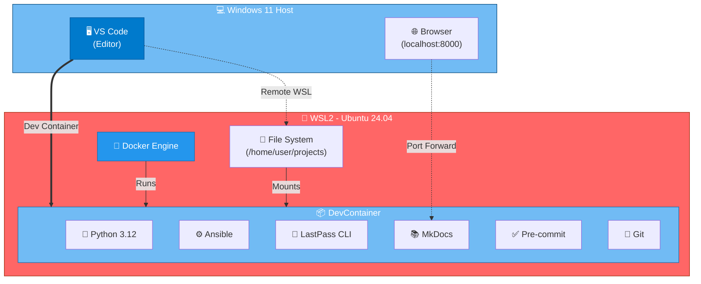
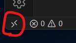
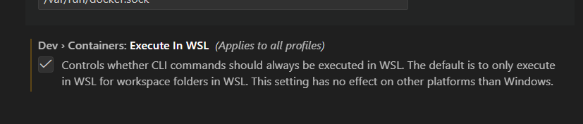
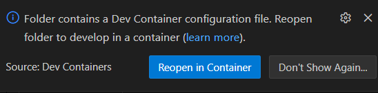
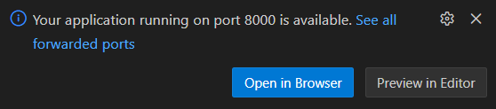

# Oppsett av PC for utvikling

Dette oppsettet er basert på at brukeren har en Windows 11 PC.
Og vi bruker WSL2 med Ubuntu 24.04, docker for devcontainers og VSCode som editor

Dette er i første rekke en hjelp for netverkskonsulenter for å komme opp på felles
verktøyplatform for deling av kode og enkelt kunne hoppe inn o kjøre andres kode.

## Arkitektur-oversikt



**Forklaring:**

- **Windows 11**: Din fysiske PC, kjører VS Code og browser
- **WSL2**: Linux-miljø i Windows, kjører Docker Engine
- **DevContainer**: Isolert utviklingsmiljø med alle verktøy installert
- **Port Forwarding**: Tilgang til tjenester som kjører i containeren (f.eks. MkDocs på port 8000)

## Installasjon av WSL2

[Microsoft dokumentasjon](https://learn.microsoft.com/en-us/windows/wsl/install)

Start PowerShell som administrator og kjør:

```bash
wsl --install
```

Så må PC rebootes.

I PowerShell som admin igjen:

```bash
wsl.exe --install Ubuntu-24.04
```

Du blir spurt om å lage bruker og sette passord i ubuntuen som ble installert.

```bash
exit
```

Finn ubuntu i startmenyen og velg det og se at det starter opp.

Oppdater programvaren med:

```bash
sudo apt update
sudo apt upgrade -y
```

i PowerShell vinduet:

```bash
wsl --shutdown
```

Etter reboot kommer ubuntu profil inn i terminal

## Docker i WSL2 (uten docker desktop som krever lisens)

Installere docker i wsl2:

```bash
sudo apt install apt-transport-https ca-certificates curl software-properties-common
curl -fsSL https://download.docker.com/linux/ubuntu/gpg | sudo gpg --dearmor -o /usr/share/keyrings/docker-archive-keyring.gpg
echo "deb [arch=$(dpkg --print-architecture) signed-by=/usr/share/keyrings/docker-archive-keyring.gpg] https://download.docker.com/linux/ubuntu $(lsb_release -cs) stable" | sudo tee /etc/apt/sources.list.d/docker.list > /dev/null
sudo apt update
sudo apt install docker-ce docker-ce-cli containerd.io docker-buildx-plugin docker-compose-plugin
sudo usermod -aG docker $USER
```

Lukk Linux vinduet og åpne igjen, sjekk at du er medlem av docker gruppa:

```bash
id
```

output skal bli noe som dette:

```bash
uid=1000(arne) gid=1000(arne) groups=1000(arne),4(adm),24(cdrom),27(sudo),30(dip),46(plugdev),100(users),989(docker)
```

Teste docker:

```bash
docker run hello-world
```

Installer docker-compose og Python venv

```bash
sudo apt install docker-compose -y
sudo apt install python3.12-venv -y
```

## SSH nøkkel

SSH pålogging uten brukernavn og passord krever ssh nøkkel.

```bash
ssh-keygen
```

(Sett passord)

Laste ssh nøkkel inn i ssh-agent ved start (innlogging)

```bash
nano ~/.bashrc
```

Legg inn på slutten:

```bash
# start ssh-agent and load key
if ! pgrep -u "$USER" ssh-agent > /dev/null; then
   ssh-agent -s > ~/.ssh/ssh-agent-env
fi
if [ -f ~/.ssh/ssh-agent-env ]; then
    . ~/.ssh/ssh-agent-env > /dev/null
fi
ssh-add ~/.ssh/id_ed25519
```

Teste å laste inn med:

```bash
source ~/.bashrc
```

Du blir spurt om passordet. For sessjonen vil du nå ikke bli spurt om passordet på
nøkkelen hver gang den er i bruk. Det er mulig å legge passordet i lastpass og bruke
commandline lpass osv.

## VSCode

I Windows - start opp "Microsoft store" og finn fram med å søke på vscode og klikk installer.

Nede i høyre hjørne klikk på open a Remote window og velg connect to wsl.



Det er en setting som må endres:

File - Preferences - Settings



Så husker jeg ikke om jeg tok en reboot av hele maskinen før jeg testet videre.

## Test oppsettet

For å teste at alt viker må du clone dette repoet (alt dette i linux):

Lag først en katalog hvor du samler de forskjellige projektene dine:

```bash
mkdir code
cd code
```

clone repoet med:

```bash
git clone https://github.com/aopdal/dev-setup.git
cd dev-setup
```

Nå skal det være mulig å starte opp VSCode direkte fra linux.

```bash
code .
```

Da kommer det opp en melding nede til høyre:



Velg Reopen in Container, og nå bygges containeren så det tar litt tid første gangen.

Når den er klar kan du teste å starte opp denne dokumentasjonen lokalt med:

```bash
mkdocs serve
```

Nå stares det opp en webserver lokalt:

```bash
INFO    -  Building documentation...
INFO    -  Cleaning site directory
INFO    -  Documentation built in 0.25 seconds
INFO    -  [09:20:44] Serving on http://127.0.0.1:8000/
```

Nå dukker det opp en melding i nedere høyre hjørne:



Velg Open in Browser og fortsett med neste øvelse :smile:

## Bruke ssh-agent i Windows og forwarde til WSL

Dette punktet hopper vi over for nå, men er helt klart en ting vi på sikt ønsker å legge til. Det gir samme ssh-nøkler i Windows, WSL og i devcontainer.

For å bruke dine Windows SSH-nøkler og ssh-agent i WSL, kan du gjøre følgende:

1. **Installer og start ssh-agent i Windows**

Åpne PowerShell som vanlig bruker (ikke admin) og kjør:

```powershell
Start-Service ssh-agent
Get-Service ssh-agent
```

Legg til nøkkelen din i Windows ssh-agent:

```powershell
ssh-add $env:USERPROFILE\.ssh\id_ed25519
```

2. **Installer `wsl-ssh-agent` (valgfritt, for automatisk forwarding)**

Du kan bruke [wsl-ssh-agent](https://github.com/rupor-github/wsl-ssh-agent) for å gjøre forwarding sømløst. Følg instruksjonene i repoet for installasjon.

3. **Forward ssh-agent inn i WSL**

Legg til følgende i din `~/.bashrc` eller `~/.profile` i WSL:

```bash
# Forward Windows ssh-agent inn i WSL
export SSH_AUTH_SOCK=$(wslpath "$(powershell.exe -NoProfile -Command "echo $env:SSH_AUTH_SOCK" | tr -d '\r')")
```

4. **Test at forwarding fungerer**

I WSL-terminalen, kjør:

```bash
ssh-add -l
```

Du skal nå se nøklene som er lastet i Windows ssh-agent. Nå kan du bruke ssh og git-kommandoer i WSL med nøklene dine fra Windows, uten å måtte skrive inn passord hver gang.

**Tips:**

- Husk å legge til nye nøkler i Windows ssh-agent hvis du genererer dem i WSL og vil bruke dem i Windows også.
- Hvis du bruker VSCode Remote eller DevContainers, vil forwarding av ssh-agent også fungere inn i containeren hvis du har satt opp forwarding i devcontainer.json.
